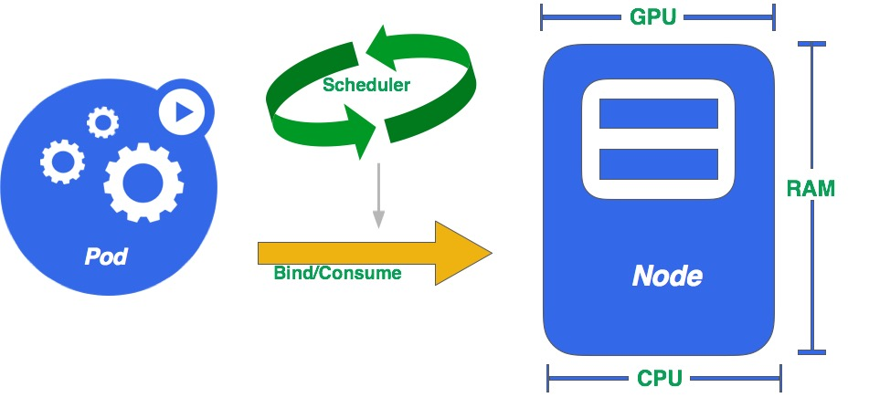

Kubernetes计算资源模型
===========================

Kubernetes的资源模型的理解对Kubernetes的使用者至关重要，它不仅关系到基础设施和资源的使用率优化，还关系到生产环境中Kubernetes集群的稳定性。

本文我们将一起探讨Kubernetes的资源模型的设计，以及我们如果利用资源模型来提高我们资源的使用率。

### 预热
--------

*在介绍资源模型之前，我们先来简单介绍一下Kubernetes的几个主要概念：*

* Node：计算节点，用来提供计算资源实体，可以理解为物理机、云主机、虚拟机等。

* Pod：Kubernetes调度容器的基本单位，Pod中包含一个或者多个容器，每个Pod最终会被调度到Node上，消费Node上提供的计算资源。

* Scheduler：Kubernetes将用户创建Pod的请求提交给Scheduler调度器，Scheduler决定Pod最终被调度到哪个Node上。

如图-1所示，Pod经过Scheduler调度，绑定到某个Node上，消费该Node提供的计算资源:




### 资源分类、抽象与表示
----------

在介绍资源模型之前，我们先介绍一下什么是**“资源”**。

对于一个Kubernetes Node（物理机、虚拟机、云主机）所提供的资源，主要分为三大类：计算资源、网络资源，存储资源。

显然这个粒度的分类对我们使用资源没有帮助，我们需要更加细分和量化这些资源，才能在系统中更好的进行资源分配和调度。

####  资源分类
----------

在计算机体系中，可以被称为"资源"的可以列举很多：

 * CPU
 * 内存
 * GPU
 * 磁盘空间(Disk space)
 * 磁盘时间(Disk time)
 * 网络带宽
 * 端口号
 * 高速缓存
 * IP地址
 * PIDs
 * ...

通常，我们称CPU、GPU、内存等为计算资源，它们大体上可分为两类：可压缩资源和不可压缩资源:

##### 可压缩资源
-----------

可压缩资源有如下特性：

 * 资源本身无状态
 * 申请资源非常快，比如我们创建个进程/线程
 * 回收资源几乎不会失败

CPU、GPU属于可压缩的资源，磁盘时间(Disk time)也属于可压缩资源。

##### 不可压缩资源
------------

不可压缩资源有如下特性：

 * 资源本身持有状态
 * 申请资源比较慢，比如申请内存，申请一块磁盘空间等
 * 回收资源时可能失败

内存、磁盘空间(Disk space)属于不可压缩资源。

这种分类方式便于更好的设计资源模型的QoS和Overcommiting，我们会在下文中详细介绍。


#### 资源抽象
------------

##### 不透明整数资源
------------

Kubernetes使用"不透明的整数资源"（*Opaque Integer Resources*）方式来量化和使用计算资源。

对于上面提到的CPU、GPU、Memory、Disk time...等，Kubernetes将他们抽象成整数，而不用关心它的具体细节。

Kubernetes将CPU每个CPU核的计算能力抽象为整数1或者1000m，如果一个Pod申请了CPU为0.5或者500m，这就代表它申请了0.5CPU核。

关于"*Opaque Integer Resources*"资源的讨论：[stackoverflow/the-opaque-integer-resources](https://stackoverflow.com/questions/42330074/how-to-understand-the-opaque-integer-resources-in-kubernetes-resource-model)

#### 资源的表示
----------

对于用户和Kubernetes组件（Scheduler, Auto-Scaler, Auto-Sizer, Load Balancers）都需要知道Pod的资源需求，Node资源能力和资源的使用率。

Kubernetes将Pod的资源需求和Node资源能力通过设定它们的Spec字段实现，资源的使用率通过设置Status字段来实现。

下面的例子说明了如何定义一个Pod的资源需求：

```json
resourceRequirementSpec: [
  request:   [ cpu: 2.5, memory: "40Mi" ],
  limit:     [ cpu: 4.0, memory: "99Mi" ],
]
```

其中：

 * request: request字段是可选的，代表Pod请求资源的数量，或者已请求和已分配的资源数量。Scheduler的调度算法已经request字段的来度量一个Pod是否适合
 一个Node（Node上足够提供request的资源）。如果一个容器或者Pod尝试使用比request更多的资源，该服务的SLO将得不到保障，在资源短缺的情况下，这种请求会失败。
 如果Request没有设置，那么它默认是limit的值。如果Pod没有设置，那么，request是pod中所有container请求资源的总和。

 * limit: limit字段也是可选的，它代表着容器或者Pod的最大资源使用上限，如果容器或者Pod使用的资源超出这个上限，它会被终止。如果不设置limit，那么意味着Pod
 可以无上限使用资源，这种方式非常危险，在实际生产运维过程中，这种不设置limit会导致不确定的行为，特别是对于内存来说，在生产环境中使用Kubernetes的团队一定要重视这个问题。

**通过设定request和limit可是实现Kubernetes不同级别的QoS和资源超卖，后面会详细讨论**

下面的例子说明Node上总体资源能力的定义：
```json
resourceCapacitySpec: [
  total:     [ cpu: 12,  memory: "128Gi" ]
]
```

其中：

 * total: Node上所有可申请的资源总量。


##### Kubernetes保留的资源定义
----------

从上面的例子中可以看出，"cpu", "memory"用来作为CPU资源和内存资源的标识，这两个是被Kubernetes保留的字段，用户定义的定义的第三方资源
不能使用这两个字段。Kubernetes对CPU和Memory两种资源进行了详细的描述：

**CPU**

 * 名称： cpu或者kubernetes.io/cpu
 * 单位: Kubernetes Compute Unit(KCU) Seconds/second(CPU核数记为"Kubernetes CPU")
 * 内部表示：milli-KCUs
 * 是否为可压缩资源：是

 为了

##### 资源的量化
----------

Kubernetes将计算资源抽象以"整数"的方式进行量化，让计算资源更好的管理。

对于内存，Kubernetes将其记为1000Mi或者1024M等，如果Pod是想申请512MB的内存，就在Pod中标记内存申请512M。

下面的例子说明了一个Pod如何申请1个CPU核和2G内存：

```json
{
  "kind": "Pod",
  "apiVersion": "v1"
  "metadata": {
    "name": "kafka-1",
    "labels": {
      "component": "kafka",
      "role": "kafka-1"
    }
  },
  "spec": {
    "restartPolicy": "Always",
    "containers": [
      {
        "name": "kafka"
        "image": "registry.docker:5000/kafka:2.11-0.9.0",
        "resources": {
          "limits": {
            "cpu": "1",           -- 申请1个CPU核
            "memory": "20480M"    -- 申请2G内存
          }
        },
        "ports": [
          {
            "containerPort": 9092
          }
        ]
      }
    ]
  }
}
```


Kubernetes将每个Node的计算资源抽象为"Capacity"，它代表着这个Node提供CPU/Memory等计算资源的总体能力，
Kubelet内置的cAdvisor组件会探测所在节点的计算能力(CPU核数和内存数)。Capacity也是通过整数的形式来描述：

```json
{
    "kind": "Node",
    "apiVersion": "v1",
    "metadata": {
        "name": "172.21.1.11",
        ...
        "labels": {
            "kubernetes.io/hostname": "172.21.1.11"
        }
    },
    "spec": {
        "externalID": "172.21.1.11"
    },
    "status": {
        "capacity": {
            "cpu": "40",             --- 共40个CPU核心
            "memory": "98760652Ki",  --- 共98G内存
        }
        ...
    }
    ...
}
```

### Node资源划分
---------------

Kubernetes为每个Node抽象了"Capacity"，它来标识Node能够提供的所有计算资源。


